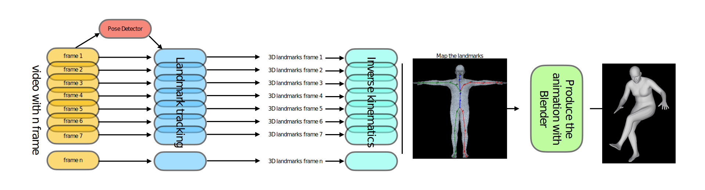

# LeMUR

### Pipeline



> [**LeMUR: Low-power 3D Emulated Motion 2D video-guided**](https://github.com/404/),            
> [Marco Garosi](https://www.instagram.com/marco_garosi/), [Riccardo Tedoldi](https://www.instagram.com/riccardotedoldi/)
Supervisor: [Giulia Martinelli](https://www4.unitn.it/du/it/Persona/PER0202241/Didattica), [Nicola Conci](https://scholar.google.it/citations?user=mR1GK28AAAAJ&hl=it)   
> *Project Computer Vision, Spring 2023* 


With our pipeline is possible to perform low-power 2D video-guided pose emulation from pose-free videos. Additionally, we provide a web interface which enable to perform the pose emulation of a video via web browser real-time. It works on smartphones and iPads!!

## Overview
Provide overview of the project
## Features
Provide a detailed list of the files involved and how to use them.
## Installation
How to install/run and requirements

## Usage
How to use

## Contributing
### Contact
If you have suggestions or ideas for further improvemets please contact us.
- riccardo tedoldi: [@riccardotedoldi](https://www.instagram.com/riccardotedoldi/)
- marco garosi: [@marcogarosi](https://www.instagram.com/marco_garosi/)

Also, if you find any bugs or issues, please let us know. We are happy to fix them!

## License
Which license is it under?

### To cite our work
```bibtex
@misc{GarosiTedoldi2022,
    title   = {LEMuR: Low-power 2D Estimated Motion 3D Renders},
    author  = {Marco Garosi, Riccardo Tedoldi, Giulia Martinelli},
    year    = {2023},
    url  = {https://github.com/r1cc4r2o/PoseEstimationTo3Drender}
}
```
