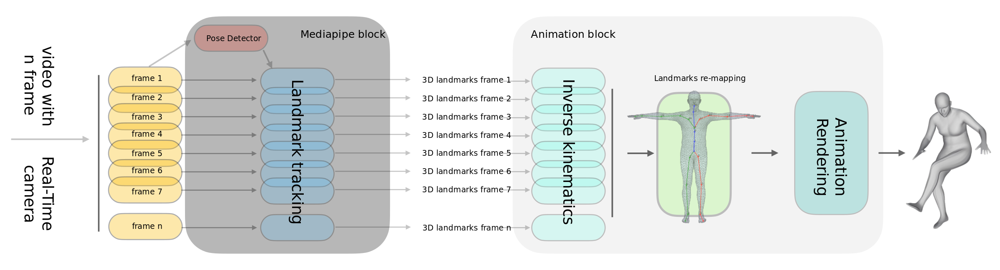

# ShadowMe
### Pipeline
---


> [**Shadow Me: Low-power 2D Motion Emulation and 3D Renders**](https://drive.google.com/file/d/1gKofOmoEIEHP3fCCUfxvfmKZdTAw6TfP),            
> [Marco Garosi](https://www.instagram.com/marco_garosi/), [Riccardo Tedoldi](https://www.instagram.com/riccardotedoldi/)
>
> Supervisor: [Giulia Martinelli](https://www4.unitn.it/du/it/Persona/PER0202241/Didattica), [Nicola Conci](https://scholar.google.it/citations?user=mR1GK28AAAAJ&hl=it)   
> *Computer Vision Project, Spring 2023* 

---

With `ShadowMe` is possible to perform low-power 2D video-guided pose emulation from pose-free videos. Additionally, we provide a web interface which enable to perform the pose emulation of a video via web browser real-time. It works on smartphones and iPads!!

## Overview

Our solution is highly efficient because it is based on the Mediapipe library, which offers a variety of tools that balance performance with available hardware resources. Using our pipeline, which leverages Mediapipe, we can easily track human poses in 2D videos and reproduce their motion in a virtual environment with real-time performance. Compared to high-resource models, our solution appears to be a reasonable alternative. We tested our solution on an iPad and were able to achieve real-time performance of the tracked motion in the virtual environment at 25/30 fps. The pre-compiled web interface has been implemented to minimize the overhead of the pipeline as much as possible. The landmarks, estimated with Mediapipe with the holistic setting, are fed to an inverse kinematic solver ([Kalidokit](https://github.com/yeemachine/kalidokit)) which outputs rig positioning and rotations. This information is smoothed on the temporal axis and then mapped onto a 3D VRM model through Three.js, which also renders the scene in the browser window.
## Structure and features of the repository

Folders:

+ `ShadowMe`: the `ShadowMe` folder contains the implemented pipeline proposed in the report [here](https://drive.google.com/file/d/1gKofOmoEIEHP3fCCUfxvfmKZdTAw6TfP). The code has been documented thoroughly, and more detailed explanations can be found within the code itself.

+ `poseExtraction`: The `poseExtraction` folder contains some of the experiments we have conducted, which have helped us gain a deeper understanding of the field. We report some of the experiments we conducted in attempting to extract the pose rotations and enable rendering in Blender. We encountered problems in converting and producing the BVH file.

+ `humanMotionGeneration`: In the `humanMotionGeneration` folder we did some experiments with the current SoTA of human motion generation. However, currently it would be impossible to extend the pipeline with motion generation from textual prompts, due mainly to the computational complexity of the task.

## Installation

In order to test `ShadowMe`, it is necessary to install the dependencies and execute a few lines of code on the bash.

### Requirements

To install the necessary dependencies, download the requirements listed below:

* Node.js (version 19.8.1 was used for development)
    * [download and installation](https://nodejs.org/en/download)
* npm (version 9.6.2 was used for development)
    * [npm installation guide](https://docs.npmjs.com/downloading-and-installing-node-js-and-npm)
* additional modules, which will be automatically downloaded during installation

### Usage

* Clone the repository
```bash
git clone https://github.com/r1cc4r2o/ShadowMe.git
```
* Move to the root (`ShadowMe`) folder
```bash
cd $PATH/ShadowMe
```
* Once you installed the right [npm](https://docs.npmjs.com/downloading-and-installing-node-js-and-npm) version, run `npm install`
```bash
npm install
npm run dev
```


It would be possiple to run the pipeline on both:

+ on a 2D single RGB video

+ on real-time 2D single RGB camera


## Contributing

We have made our implementation publicly available, and we welcome anyone who would like to join us and contribute to the project.
### Contact
If you have suggestions or ideas for further improvemets please contact us.
- riccardo tedoldi: [@riccardotedoldi](https://www.instagram.com/riccardotedoldi/)
- marco garosi: [@marcogarosi](https://www.instagram.com/marco_garosi/)

Also, if you find any bugs or issues, please let us know. We are happy to fix them!

## License
The repo is under the licence CC BY-NC-ND, we allows others to use, distribute, and modify the work for non-commercial purposes only, as long as they give credit to the creators.

> *CC BY-NC: Creative Commons Attribution-NonCommercial-NoDerivatives* 
### To cite our work
```bibtex
@misc{GarosiTedoldi2022,
    title   = {Shadow Me: Low-power 2D Motion Emulation and 3D Renders},
    author  = {Marco Garosi, Riccardo Tedoldi, Giulia Martinelli},
    year    = {2023},
    url  = {https://github.com/r1cc4r2o/ShadowMe}
}
```
